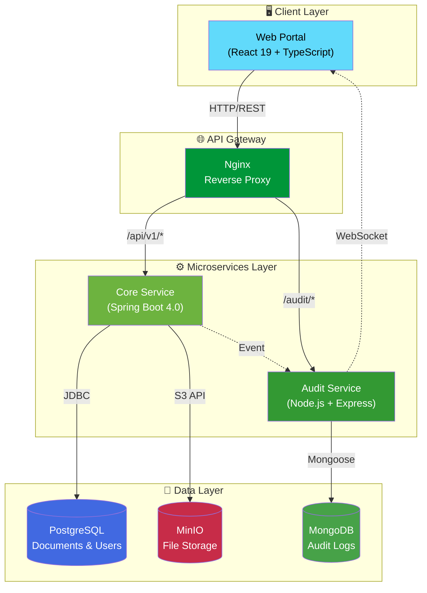
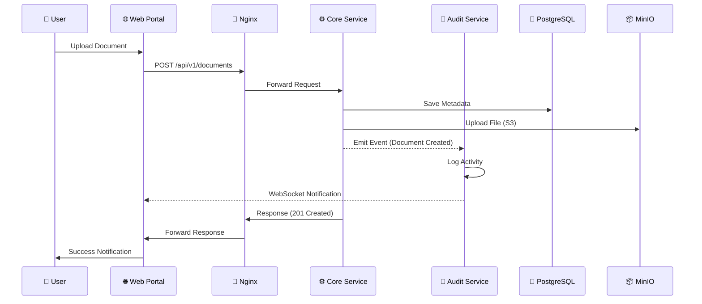
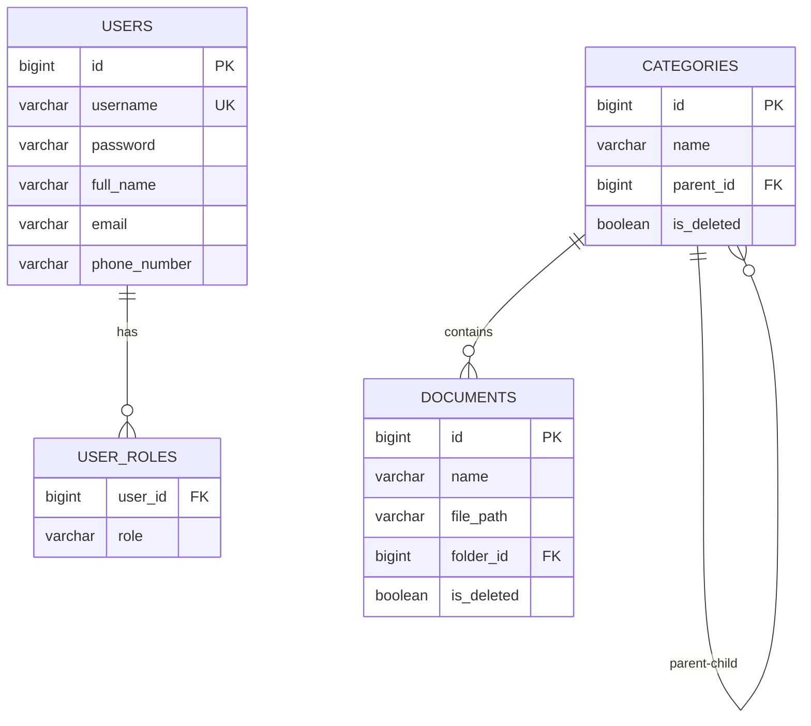

# 📁 SMART-EDMS System

<div align="center">


**Hệ thống Quản lý Tài liệu Điện tử Thông minh** - Giải pháp lưu trữ, quản lý và truy xuất tài liệu doanh nghiệp dựa trên kiến trúc Microservices hiện đại.

[Tính năng](#-tính-năng-chính) • [Kiến trúc](#-kiến-trúc-hệ-thống) • [Công nghệ](#-tech-stack) • [Cài đặt](#-hướng-dẫn-cài-đặt)

</div>

---

## 📋 Giới thiệu

**SMART-EDMS** (Smart Electronic Document Management System) là hệ thống quản lý tài liệu điện tử toàn diện được thiết kế để giúp doanh nghiệp:

- 📂 **Tổ chức tài liệu** theo cấu trúc phân cấp (thư mục, danh mục) một cách khoa học
- 🔍 **Tìm kiếm nhanh chóng** với bộ lọc thông minh và full-text search
- 🔐 **Bảo mật chặt chẽ** với hệ thống phân quyền RBAC (Role-Based Access Control)
- 📊 **Theo dõi hoạt động** với audit log và thông báo real-time
- ☁️ **Lưu trữ đám mây** với MinIO (S3-Compatible Object Storage)

---

## ✨ Tính năng chính

| Tính năng                    | Mô tả                                                      | Trạng thái         |
| ---------------------------- | ---------------------------------------------------------- | ------------------ |
| 🔐 **Xác thực & Phân quyền** | JWT Authentication, Role-based Access Control (Admin/User) | ✅ Hoàn thành      |
| 📁 **Quản lý Danh mục**      | CRUD danh mục với cấu trúc cây phân cấp (Tree Structure)   | ✅ Hoàn thành      |
| 📄 **Quản lý Tài liệu**      | Upload, download, xem trước, soft delete tài liệu          | 🔄 Đang phát triển |
| 🔍 **Tìm kiếm**              | Full-text search, lọc theo danh mục, ngày tạo, loại file   | 📋 Kế hoạch        |
| 📊 **Audit Logging**         | Ghi lại mọi thao tác của người dùng với timestamp          | 🔄 Đang phát triển |
| 🔔 **Thông báo Real-time**   | WebSocket notifications khi có thay đổi                    | 📋 Kế hoạch        |
| 📈 **Dashboard & Báo cáo**   | Thống kê sử dụng, biểu đồ trực quan                        | 📋 Kế hoạch        |

---

## 🏛 Kiến trúc hệ thống

### High-Level Architecture



### Service Communication Flow



### Database Schema (Core Service)



---

## 🛠 Tech Stack

### Frontend

| Technology   | Version | Purpose                 |
| ------------ | ------- | ----------------------- |
| React        | 19.2    | UI Framework            |
| TypeScript   | 5.6     | Type Safety             |
| Vite         | 6.0     | Build Tool & Dev Server |
| TailwindCSS  | 4.0     | Utility-first CSS       |
| React Router | 7.x     | Client-side Routing     |
| Lucide React | -       | Icon Library            |
| Motion       | 12.x    | Animation Library       |

### Backend - Core Service

| Technology        | Version  | Purpose                        |
| ----------------- | -------- | ------------------------------ |
| Java              | 21 (LTS) | Programming Language           |
| Spring Boot       | 4.0.2    | Application Framework          |
| Spring Security   | -        | Authentication & Authorization |
| Spring Data JPA   | -        | ORM & Data Access              |
| JWT (jjwt)        | 0.12.3   | Token-based Auth               |
| Lombok            | -        | Boilerplate Reduction          |
| Springdoc OpenAPI | 2.8.5    | API Documentation (Swagger)    |

### Backend - Audit Service

| Technology | Version | Purpose                 |
| ---------- | ------- | ----------------------- |
| Node.js    | 20.x    | Runtime Environment     |
| Express    | -       | Web Framework           |
| Socket.io  | -       | Real-time Communication |
| Mongoose   | -       | MongoDB ODM             |

### Infrastructure

| Technology     | Purpose                             |
| -------------- | ----------------------------------- |
| PostgreSQL 15  | Primary Database (Documents, Users) |
| MongoDB        | Audit Logs Storage                  |
| MinIO          | S3-Compatible Object Storage        |
| Nginx          | Reverse Proxy & Load Balancer       |
| Docker Compose | Container Orchestration             |

---

## 📂 Cấu trúc dự án

```
SMART-EDMS-SYSTEM/
│
├── 📱 apps/
│   └── web-portal/                 # React Frontend Application
│       ├── src/
│       │   ├── pages/              # Page Components
│       │   ├── components/         # Reusable UI Components
│       │   └── assets/             # Static Assets
│       └── package.json
│
├── ⚙️ services/
│   ├── core-service/               # Spring Boot Backend
│   │   ├── src/main/java/com/smartedms/
│   │   │   ├── config/             # Security, OpenAPI configs
│   │   │   ├── controller/         # REST Controllers
│   │   │   ├── dto/                # Data Transfer Objects
│   │   │   ├── entity/             # JPA Entities
│   │   │   ├── repository/         # Data Access Layer
│   │   │   ├── service/            # Business Logic
│   │   │   ├── filter/             # JWT Auth Filter
│   │   │   └── utils/              # Utility Classes
│   │   └── pom.xml
│   │
│   └── audit-service/              # Node.js Audit Service
│       └── src/index.js            # Express + Socket.io Server
│
├── 🐳 infrastructure/
│   ├── docker-compose.yml          # PostgreSQL, MongoDB, MinIO
│   └── nginx/                      # Reverse Proxy Configuration
│
└── 📄 README.md
```

---

## 🚀 Hướng dẫn cài đặt

### Yêu cầu hệ thống

- **Docker** & **Docker Compose** (khuyến nghị)
- **Java 21** (cho Core Service)
- **Node.js 20+** (cho Audit Service)
- **npm** hoặc **yarn**

### 1️⃣ Khởi chạy Infrastructure

```bash
cd infrastructure
docker-compose up -d
```

Dịch vụ sẽ chạy tại:
| Service | Port | Console |
|---------|------|---------|
| PostgreSQL | 5432 | - |
| MongoDB | 27017 | - |
| MinIO | 9000 | http://localhost:9001 |

### 2️⃣ Khởi chạy Core Service

```bash
cd services/core-service
./mvnw spring-boot:run
```

- API: `http://localhost:8080`
- Swagger UI: `http://localhost:8080/swagger-ui.html`

### 3️⃣ Khởi chạy Audit Service

```bash
cd services/audit-service
npm install && npm run dev
```

- Service: `http://localhost:3000`

### 4️⃣ Khởi chạy Web Portal

```bash
cd apps/web-portal
npm install && npm run dev
```

- Portal: `http://localhost:5173`

---

## 📚 API Documentation

API được document đầy đủ với **Swagger/OpenAPI**. Sau khi chạy Core Service, truy cập:

```
http://localhost:8080/swagger-ui.html
```

### Các API chính:

| Method | Endpoint                | Description               |
| ------ | ----------------------- | ------------------------- |
| `POST` | `/api/auth/login`       | Đăng nhập, nhận JWT token |
| `POST` | `/api/auth/register`    | Đăng ký tài khoản mới     |
| `GET`  | `/api/categories/tree`  | Lấy cây danh mục          |
| `POST` | `/api/categories`       | Tạo danh mục mới          |
| `GET`  | `/api/documents`        | Danh sách tài liệu        |
| `POST` | `/api/documents/upload` | Upload tài liệu           |

---

## 🔐 Bảo mật

- **JWT Authentication**: Token-based stateless authentication
- **BCrypt Password Hashing**: Mã hóa mật khẩu an toàn
- **RBAC**: Phân quyền theo vai trò (ROLE_ADMIN, ROLE_USER)
- **CORS Configuration**: Kiểm soát truy cập cross-origin
- **Soft Delete**: Không xóa vĩnh viễn dữ liệu, hỗ trợ khôi phục

---

## 👨‍💻 Tác giả

**[Do Tien Hung]**

- 📧 Email: tienhung1624@gmail.com
- 🐙 GitHub: [@TiesnHunk](https://github.com/TiesnHunk)

---

## 📄 License

This project is licensed under the MIT License - see the [LICENSE](LICENSE) file for details.

---

<div align="center">

**⭐ Nếu project này hữu ích, hãy cho mình một star nhé! ⭐**

_🚧 Dự án đang trong quá trình phát triển - Cập nhật thường xuyên 🚧_

</div>
